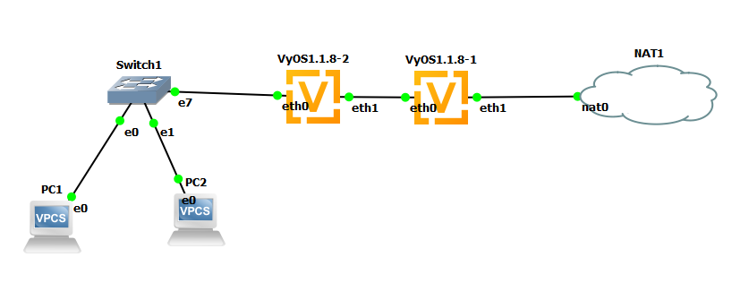

# KIV/PSI #04

    

### Subnet ranges
**Subnet:** `192.168.123.0/24`  
**Subnet (end devices):** `192.168.123.0/25`  
**Subnet (routers):** `192.168.123.128/30`  
**R2:** `192.168.123.1 (eth0)`  
**R2:** `192.168.123.129 (eth1)`  
**R1:** `192.168.123.130 (eth0)`  
**End-device DHCP:** `192.168.123.11 - 192.168.123.126`  

### Configuration
Router configuration commands: **[psi04.txt](psi04.txt)**  
To set end-device IP use command: `ip dhcp`
